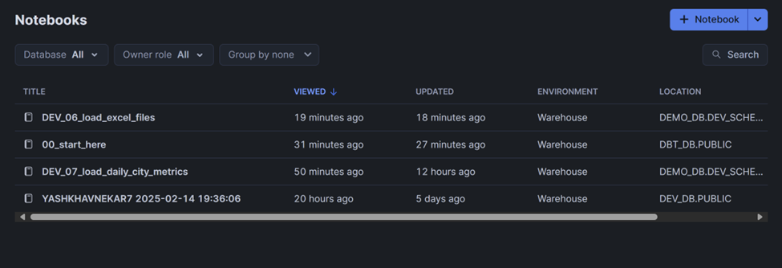

# Lab 2 Screenshots

## Overview
This repository contains screenshots and descriptions of the successful execution of Lab 2 tasks, including DAG creation, task execution, and Git integration.

## Deployment Details
- The code for deploying notebooks on the `dev` branch was successfully executed.

- After loading all the data, we successfully created the dag workflow.

- Three DAGs indicating three tasks have been created according to the provided diagram.

## Git Integration
- We have also successfully integrated Git by updating the code in the specified file and creating a PR to the `main` branch.

## DAG Execution
All DAGs created in the steps above are successfully running:

### `DEMO_DAG`
- Successfully created and executed.

### `DEMO_DAG$LOAD_DAILY_CITY_METRICS`
- Successfully created and executed.

### `DEMO_DAG$LOAD_EXCEL_FILES_TASK`
- Successfully created and executed.

## Final Outputs
- The final tables, notebooks, and tasks have been successfully created in the database.

---

This README provides a summary of Lab 2's execution and results. For more details, refer to the screenshots and code available in this repository.

